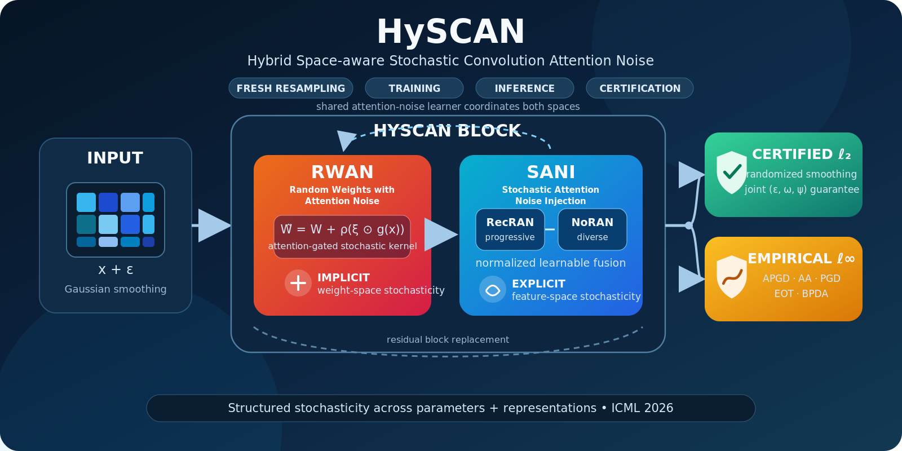

<div align="center">



# Does a Hybrid Space-Aware Randomized Defense Improve Empirical and Certified Adversarial Robustness?

### **HySCAN: Hybrid Space-aware Stochastic Convolution Attention Noise**

[](https://icml.cc/virtual/2026/poster/65726)
[](https://proceedings.mlr.press/v306/)
[](#certified-robustness)
[](#empirical-robustness)
[](https://www.tensorflow.org/)
[](https://www.python.org/)

**Proceedings of the 43rd International Conference on Machine Learning (ICML 2026), PMLR 306**

[ICML paper page](https://icml.cc/virtual/2026/poster/65726) · [Notebook](Code/hyscan.ipynb) · [Method](docs/METHOD.md) · [Certification](docs/CERTIFICATION.md) · [Datasets](docs/DATASETS.md) · [Results](docs/RESULTS.md) · [Reproducibility](docs/REPRODUCIBILITY.md) · [Citation](#citation)

<details>
<summary><b>Full author list</b></summary>
<br>
Joy Dhar, Manish Kumar Pandey, Behzad Bozorgtabar, Nayyar Zaidi, Wenyu Zhang, Wei-Hong Li, Tingting Mu, Dwarikanath Mahapatra, Mahsa Baktashmotlagh, Trung Le, Chen Chen, Sajib Mistry, Camila Gonzalez, Samira Ebrahimi Kahou, Lina Yao, Piotr Koniusz, Robert B. Fisher, Dinh Phung, Bohyung Han, Nuno Vasconcelos, and Pietro Lio
</details>

</div>

---

## TL;DR

**HySCAN replaces standard convolutional blocks with a coupled stochastic design that randomizes both how features are computed and what their representations look like.** Random Weights with Attention Noise (**RWAN**) applies input-conditioned, attention-gated perturbations to convolution kernels, while Stochastic Attention Noise Injection (**SANI**) injects a normalized mixture of recursive and non-recursive attention noise into block features. All internal randomness is freshly resampled during training, inference, attacks, and randomized-smoothing certification.

This joint formulation preserves standard randomized-smoothing **ℓ₂ certificates** while strengthening empirical robustness against modern **ℓ∞ attacks**, including APGD, AutoAttack, PGD, EOT-PGD, BPDA, and EOT-BPDA.

## At a glance

| Item | HySCAN setting |
|---|---|
| Core idea | Cross-space-coupled stochasticity in convolutional operators and feature representations |
| Weight-space module | **RWAN** — SANI-aware, input-conditioned heteroscedastic kernel perturbations |
| Feature-space module | **SANI** — normalized fusion of **RecRAN** and **NoRAN** perturbations |
| Certified threat model | Randomized-smoothing **ℓ₂** certification over joint randomness `(ε, ω, ψ)` |
| Empirical threat model | White-box **ℓ∞** attacks with model randomness active and resampled |
| Paper backbones | ResNet-110 for CIFAR-10/100; ResNet-50 for the remaining benchmarks |
| Benchmarks | 8 natural-image and medical-imaging datasets |
| Current code release | TensorFlow/Keras research notebook with a ResNet-18-style HySCAN prototype |

## Motivation

Most stochastic defenses inject randomness at only one location—typically the input, weights, or features. Such localized noise can be averaged out by adaptive attacks, may be insufficient for representation smoothing, or can degrade discriminative structure when injected indiscriminately.

HySCAN couples two complementary mechanisms inside each convolutional block:

1. **RWAN hardens the operator:** the effective convolution kernel changes across forward passes through bounded, attention-gated Gaussian perturbations.
2. **SANI hardens the representation:** intermediate features receive scale-controlled, attention-modulated perturbations that combine progressive smoothing and diverse channel-aware noise.

The same SANI attention-noise learner serves two coordinated roles: it forms the per-layer gate that controls RWAN weight perturbations and performs explicit feature injection at the end of each HySCAN block.

## Method

A HySCAN block transforms an input feature map `xᵢ` through a stochastic RWAN residual branch followed by SANI:

$$
 z_i(x_i)=S_i\!\left(x_i+G_i^{J_i}(x_i;\omega_i);\psi_i\right).
$$

### RWAN: implicit weight-space stochasticity

For a deterministic convolution kernel $W$, RWAN samples Gaussian weight noise $\xi$ and modulates it with an input-conditioned channel gate $g(x)$ derived from SANI:

$$
\widetilde{W}(x;\omega)=W+\rho\bigl(\xi\odot g(x)\bigr),
\qquad \rho=\operatorname{SoftPlus}(\rho_{\mathrm{logit}})\ge 0.
$$

The max-absolute-normalized gate bounds perturbation amplification and produces heteroscedastic kernel variance: salient input channels can receive stronger perturbations while other channels remain closer to the deterministic kernel.

### SANI: explicit feature-space stochasticity

SANI combines two complementary feature perturbations:

- **RecRAN:** recursive stochastic attention modulation for progressive smoothing.
- **NoRAN:** single-pass, channel-aware randomized perturbations for complementary diversity.

Their residual increments are fused with nonnegative, learnable, normalized weights:

$$
\mathcal{A}(u;\psi)=
\frac{\lambda_{\mathrm{rec}}\Delta^{\mathrm{rec}}+\lambda_{\mathrm{nor}}\Delta^{\mathrm{nor}}}
{\lambda_{\mathrm{rec}}+\lambda_{\mathrm{nor}}+\nu},
\qquad \lambda_{\mathrm{rec}},\lambda_{\mathrm{nor}}\ge 0.
$$

This fusion is scale-controlled: the combined perturbation cannot exceed the larger branch increment under a convex norm.

### Joint randomized classifier

HySCAN defines the smoothed predictor over Gaussian input noise $\varepsilon$ and both internal noise sources—RWAN randomness $\omega$ and SANI randomness $\psi$:

$$
F_\Theta(x)=\arg\max_{c\in\mathcal{Y}}
\Pr_{\varepsilon,\omega,\psi}
\left[f_\Theta(x+\varepsilon;\omega,\psi)=c\right].
$$

Because certification estimates class probabilities under this **full joint randomness**, the standard randomized-smoothing certificate remains valid for the deployed stochastic predictor. See [the method guide](docs/METHOD.md) and [certification guide](docs/CERTIFICATION.md).

## Highlights

- **Hybrid robustness:** jointly targets certified ℓ₂ and empirical ℓ∞ robustness rather than optimizing only one regime.
- **Cross-space coupling:** coordinates weight- and feature-space stochasticity through a shared attention-noise learner.
- **Adaptive evaluation:** keeps all internal randomness active under PGD, APGD, AutoAttack, EOT-PGD, BPDA, and EOT-BPDA.
- **Domain breadth:** evaluates natural-image and medical-imaging benchmarks with the same defense principle.
- **Transparent cost accounting:** reports parameters, FLOPs, activation memory, inference latency, and certification sampling cost.

<a id="certified-robustness"></a>

## Certified ℓ₂ robustness

The paper reports improvements of up to **9.6 percentage points** over ARS at nonzero certified radii. Representative operating points are shown below.

| Dataset | `(σ, r)` | HySCAN certified accuracy | Comparison | Gain |
|---|---:|---:|---:|---:|
| CIFAR-10 | `(0.25, 1.25)` | **30.7%** | ARS: 21.1% | **+9.6 pp** |
| ImageNet-1k | `(0.25, 1.00)` | **42.3%** | ARS: 39.1% | **+3.2 pp** |
| NIH-CXR | `(1.00, 1.00)` | **42.9%** | ARS: 34.1% | **+8.8 pp** |
| HAM10000 | `(1.00, 1.00)` | **39.5%** | ARS: 34.6% | **+4.9 pp** |

At the difficult low-noise/high-radius point `(σ, r) = (0.25, 2.0)`, HySCAN reports nonzero certified accuracy on both ImageNet (**7.15%**) and CIFAR-10 (**9.94%**).

<a id="empirical-robustness"></a>

## Empirical ℓ∞ robustness

Across the four medical benchmarks evaluated with APGD-20 and AA-20, HySCAN reports robust accuracy from **55.2% to 90.7%** while retaining strong clean accuracy.

| Dataset | Clean | APGD-20 `8/255` | APGD-20 `16/255` | AA-20 `8/255` | AA-20 `16/255` |
|---|---:|---:|---:|---:|---:|
| NCT-CRC-HE-100K | **91.5** | **90.7** | **80.2** | **89.5** | **77.3** |
| NIH-CXR | **90.1** | **88.9** | **78.1** | **87.3** | **75.1** |
| EyePACS | **78.3** | **73.9** | **62.2** | **73.1** | **60.5** |
| HAM10000 | **75.1** | **68.3** | **57.2** | **66.9** | **55.2** |

The extended natural-image evaluation at `ε = 8/255` reports:

| Dataset | Clean | PGD-20 | AA-20 |
|---|---:|---:|---:|
| CIFAR-10 | **90.93** | **74.63** | **78.47** |
| ImageNet-1k | **74.24** | **60.69** | **68.32** |

All values above are percentages reported by the paper. See [RESULTS.md](docs/RESULTS.md) for the broader certified, empirical, ablation, and complexity tables.

## Ablation: why both spaces matter

On CIFAR-10 with `σ = 0.25`, certified radius `r = 0.75`, and PGD-20 at `ε = 8/255`:

| RWAN | SANI | Certified accuracy | PGD-20 accuracy |
|:---:|:---:|---:|---:|
| ✗ | ✗ | 26.1 | 59.8 |
| ✗ | ✓ | 37.5 | 67.9 |
| ✓ | ✗ | 40.1 | 69.7 |
| ✓ | ✓ | **45.5** | **74.3** |

The complete hybrid block improves over the no-HySCAN baseline by **19.4 pp** certified accuracy and **14.5 pp** PGD-20 accuracy. RecRAN and NoRAN are also complementary: their fused SANI configuration is stronger than either branch alone.

## Robustness–cost trade-off

HySCAN deliberately spends additional computation to maintain structured stochasticity at deployment and certification time.

| Backbone / input | Variant | Parameters | FLOPs | Activation memory | Inference |
|---|---|---:|---:|---:|---:|
| ResNet-50 / `224×224×3` | Vanilla | 25.6M | 3.8G | 98.89 MB | 2.29 ms |
| ResNet-50 / `224×224×3` | **HySCAN** | **149.8M** | **179.03G** | **571.4 MB** | **15.7 ms** |
| ResNet-110 / `32×32×3` | Vanilla | 47.6M | 8.10G | 105.33 MB | 0.33 ms |
| ResNet-110 / `32×32×3` | **HySCAN** | **101.6M** | **8.75G** | **387.71 MB** | **4.29 ms** |

Randomized-smoothing certification is additionally sampling-intensive. The paper's common setting uses `n₀ = 100`, `n = 100,000`, and `α = 0.001`, with fresh Gaussian, RWAN, and SANI randomness for every query.

## Benchmarks

| Domain | Datasets |
|---|---|
| Natural images | CIFAR-10, CIFAR-100, ImageNet-1k, CelebA |
| Medical imaging | NCT-CRC-HE-100K, NIH-CXR, EyePACS, HAM10000 |

The paper uses ResNet-110 for CIFAR-10/100 and ResNet-50 for all other datasets. Dataset-specific certification subsets and optimization recipes are documented in [DATASETS.md](docs/DATASETS.md) and [REPRODUCIBILITY.md](docs/REPRODUCIBILITY.md).

## Repository structure

```text
HySCAN/
├── Code/
│   └── hyscan.ipynb              # TensorFlow/Keras research notebook
├── assets/
│   ├── hyscan-overview.svg       # Editable project figure
│   ├── hyscan-overview.png       # README figure
│   └── hyscan-social-preview.png # GitHub social preview
├── docs/
│   ├── METHOD.md                  # Architecture and theory guide
│   ├── CERTIFICATION.md           # Joint-randomness RS protocol
│   ├── DATASETS.md                # Benchmarks and evaluation matrix
│   ├── RESULTS.md                 # Paper-reported result tables
│   └── REPRODUCIBILITY.md         # Paper protocol vs. current release
├── CITATION.cff
├── citation.bib
├── environment.yml
├── requirements.txt
├── LICENSE-NOTICE.md
└── README.md
```

## Getting started

### 1. Clone the repository

```bash
git clone https://github.com/misti1203/HySCAN.git
cd HySCAN
```

### 2. Create an environment

Using Conda:

```bash
conda env create -f environment.yml
conda activate hyscan
```

Or using `venv` and `pip`:

```bash
python -m venv .venv
source .venv/bin/activate      # Windows: .venv\Scripts\activate
python -m pip install --upgrade pip
pip install -r requirements.txt
```

### 3. Prepare the notebook inputs

The current notebook loads preprocessed arrays from its working directory:

```text
X.npy  # image tensor
Y.npy  # labels
```

Update the paths, input shape, number of classes, and model-construction cell for your dataset before running:

```bash
jupyter lab Code/hyscan.ipynb
```

> **Release scope.** The notebook is an experiment-oriented TensorFlow/Keras prototype. It demonstrates HySCAN building blocks, a ResNet-18-style integration, Gaussian-noise training, smoothing utilities, and a PGD example. It is **not yet a one-command reproduction** of every ResNet-110/ResNet-50 experiment, adaptive attack, ablation, or certification table in the paper. Follow [REPRODUCIBILITY.md](docs/REPRODUCIBILITY.md) before claiming paper-level reproduction.

## Paper protocol summary

| Dataset family | Backbone | Epochs | Batch | Optimizer and initial LR |
|---|---|---:|---:|---|
| CIFAR-10/100 | ResNet-110 | 200 | 256 | AdamW, `1e-2`, weight decay `1e-4` |
| CelebA + medical datasets | ResNet-50 | 200 | 64 | SGD, `5e-2` |
| ImageNet-1k | ResNet-50 | 200 | 300 | SGD, `1e-1`, momentum `0.9`, weight decay `1e-4` |

Results are averaged over five random seeds, and the paper reports experiments on an NVIDIA A100 80GB GPU.

## Responsible interpretation

- The formal guarantee applies to the paper's randomized-smoothing **ℓ₂** threat model at the selected noise level and confidence. It is not a blanket guarantee against semantic, physical-world, or arbitrary attacks.
- Empirical **ℓ∞** robustness depends on the stated attack protocol, including keeping HySCAN randomness active and resampling it throughout adaptive evaluation.
- HySCAN increases parameters, memory, latency, and Monte Carlo certification cost. Deployment should account for these constraints.
- Medical-image experiments are research evaluations. This repository is not a clinical device and requires domain-specific validation, monitoring, and human oversight before safety-critical use.

## Citation

```bibtex
@inproceedings{dhar2026hyscan,
  title     = {Does a Hybrid Space-Aware Randomized Defense Improve Empirical and Certified Adversarial Robustness?},
  author    = {Dhar, Joy and Pandey, Manish Kumar and Bozorgtabar, Behzad and
               Zaidi, Nayyar and Zhang, Wenyu and Li, Wei-Hong and Mu, Tingting and
               Mahapatra, Dwarikanath and Baktashmotlagh, Mahsa and Le, Trung and
               Chen, Chen and Mistry, Sajib and Gonzalez, Camila and
               Ebrahimi Kahou, Samira and Yao, Lina and Koniusz, Piotr and
               Fisher, Robert B. and Phung, Dinh and Han, Bohyung and
               Vasconcelos, Nuno and Lio, Pietro},
  booktitle = {Proceedings of the 43rd International Conference on Machine Learning},
  series    = {Proceedings of Machine Learning Research},
  volume    = {306},
  publisher = {PMLR},
  year      = {2026},
  url       = {https://icml.cc/virtual/2026/poster/65726}
}
```

GitHub can also render the structured citation from [`CITATION.cff`](CITATION.cff).

## License

The current repository does not specify a software license. See [LICENSE-NOTICE.md](LICENSE-NOTICE.md) before reusing or redistributing the implementation. The authors should add an explicit open-source license after confirming ownership and third-party compatibility.

## Contact

For questions about the work, open a GitHub issue or contact the corresponding author at `joy.22csz0003@iitrpr.ac.in`.
